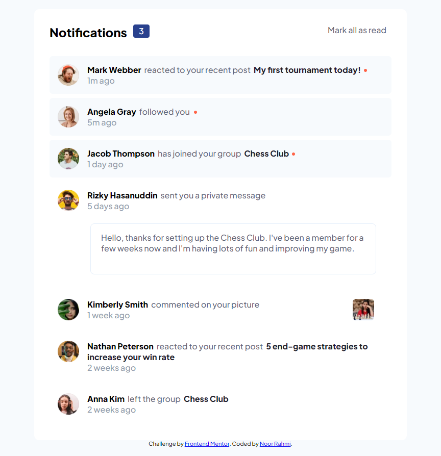
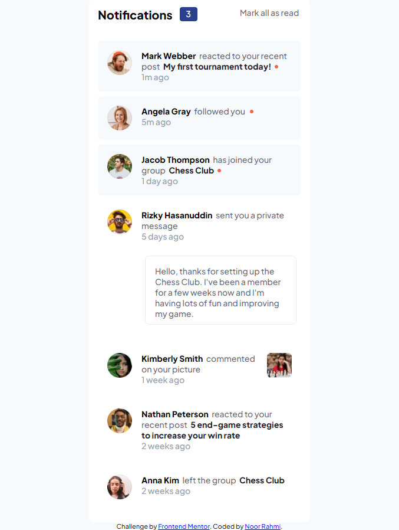

# Frontend Mentor - Notifications page solution

This is a solution to the [Notifications page challenge on Frontend Mentor](https://www.frontendmentor.io/challenges/notifications-page-DqK5QAmKbC). Frontend Mentor challenges help you improve your coding skills by building realistic projects.

## Table of contents

- [Overview](#overview)
  - [The challenge](#the-challenge)
  - [Screenshot](#screenshot)
  - [Links](#links)
- [My process](#my-process)
  - [Built with](#built-with)
  - [What I learned](#what-i-learned)
  - [Continued development](#continued-development)
  - [Useful resources](#useful-resources)
- [Author](#author)

## Overview

### The challenge

Users should be able to:

- Distinguish between "unread" and "read" notifications
- Select "Mark all as read" to toggle the visual state of the unread notifications and set the number of unread messages to zero
- View the optimal layout for the interface depending on their device's screen size
- See hover and focus states for all interactive elements on the page

### Screenshot

### Links

- Solution URL: [Github pages](https://github.com/rahmi1016/notifications-page-main)
- Live Site URL: [Live site](https://rahmi1016.github.io/notifications-page-main/)

## My process

### Built with

- Semantic HTML5 markup
- CSS custom properties
- Flexbox
- CSS Grid
- SCSS
- Javascript

### What I learned

### Continued development

It felt all over the place when I started this project. I still felt the website I made was constricted, and not dynamic enough. For further development, I will try to make it can add new message/activity.

### Useful resources

- [notification dot](https://codepen.io/armujahid/pen/zQwLJd) - This helped to understand how make notification dot

- [Add and remove class on click](https://stackoverflow.com/questions/7077673/add-and-remove-class-on-click) - This helped me to add and remove class

- [Add class to multiple elements in JavaScript](https://javascriptf1.com/snippet/add-class-to-multiple-elements-in-javascript) - This helped me to add class to multiple element

- [Vanilla JS add/remove/toggle on click](https://codepen.io/8eni/pen/MaGVrq?editors=1010) - This helped me understanding onclick function

- [How to get child element by class name?](https://stackoverflow.com/questions/12166753/how-to-get-child-element-by-class-name) - This helped me to hide the dot notification

## Author

- Frontend Mentor - [@rahmi1016](https://www.frontendmentor.io/profile/rahmi1016)
